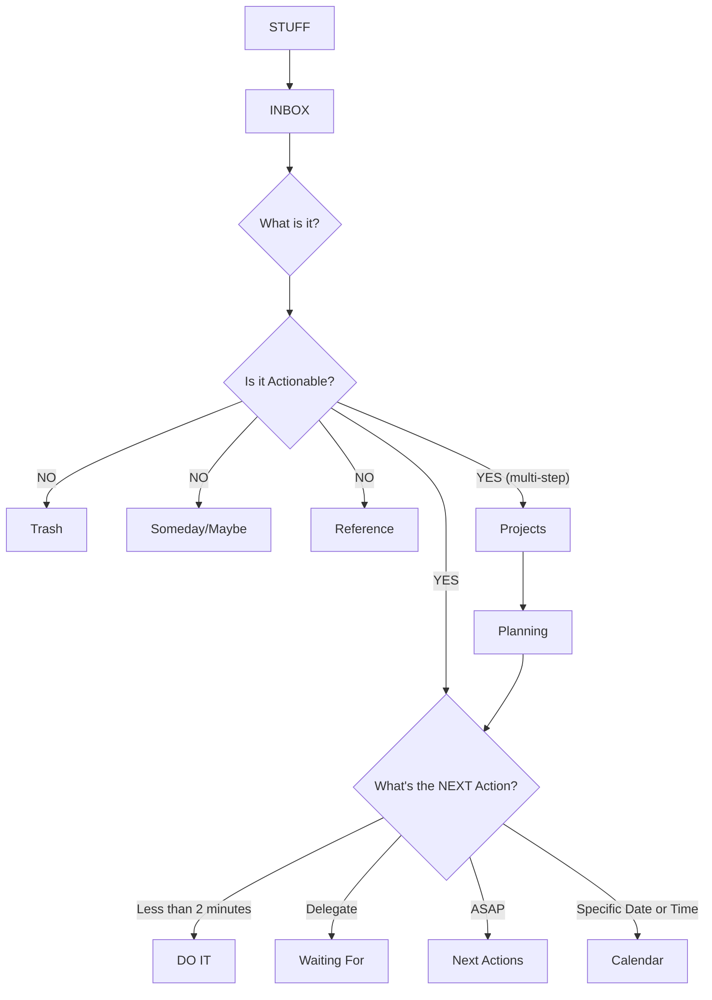

Реализация метода GTD на основе Emacs.

<!--more-->



## 1 Общая информация {#общая-информация}

-   Репозиторий: <https://github.com/Trevoke/org-gtd.el>
-   Пакет пытается максимально точно воспроизвести рабочий процесс GTD (см. [Метод GTD]()).

<!--listend-->

## 2 Режимы {#режимы}

-   `org-gtd-mode`: обновляет представления повестки дня, включать все файлы `org-gtd` в `org-agenda-files`.

## 3 Настраиваемые переменные {#настраиваемые-переменные}

-   `org-gtd-directory`: каталог, в котором `org-gtd` будет искать свои файлы.
-   `org-gtd-areas-of-focus`: список строк, представляющих Horizon 3.

## 4 Порядок работ с пакетом {#порядок-работ-с-пакетом}

  &#1058;&#1072;&#1073;&#1083;&#1080;&#1094;&#1072; 1:
  Порядок работ

| Этап GTD       | Действие в Emacs            | Команда                          | Клавиши   |
|----------------|-----------------------------|----------------------------------|-----------|
| 1. Захват      | Записать мысль в `inbox`    | `org-gtd-capture`                | `C-c d c` |
| 2. Обработка   | Начать разбор `inbox`       | `org-gtd-process-inbox`          | `C-c d p` |
| 3. Организация | Определить тип элемента     | `org-gtd-organize`               | `C-c c`   |
| 4. Вовлечение  | Показать сегодняшние задачи | `org-gtd-engage`                 | `C-c d e` |
| 5. Обзор       | Найти застрявшие проекты    | `org-gtd-reflect-stuck-projects` | `C-c d s` |

### 4.1 Захват (Capture) --- `C-c d c` {#захват--capture--c-c-d-c}

-   Цель: Быстро записать любую идею, задачу, не отвлекаясь от текущего занятия.
    -   Этот этап --- самый важный.
    -   Он помогает разгрузить голову, зафиксировав все дела в одном месте.

-   Нажмите `C-c d c` (или `M-x org-gtd-capture`).
-   Откроется небольшое окно для ввода. Опишите свою мысль.
-   Нажмите `C-c C-c`, чтобы сохранить. Задача автоматически помещается во Входящие (`inbox`).

### 4.2 Обработка и Уточнение (Process &amp; Clarify) --- `C-c d p` {#обработка-и-уточнение--process-and-clarify--c-c-d-p}

-   Цель: Регулярно (например, раз или два в день) опустошать `inbox`, превращая сырые записи в четкие, конкретные действия.

-   Нажмите `C-c d p` (или `M-x org-gtd-process-inbox`).
-   Вы попадете в специальный буфер уточнения (`clarify`).
-   Здесь можно отредактировать задачу: сделать её описание максимально ясным и конкретным, чтобы она была готова к выполнению.

### 4.3 Организация (Organize) --- `C-c c` {#организация--organize--c-c-c}

-   Цель: Принять решение о том, что это за элемент и куда его поместить в вашей системе GTD.

-   Находясь в буфере уточнения (`clarify`), нажмите `C-c c` (или `M-x org-gtd-organize`).
-   Появится меню, где вы выбираете тип элемента:
    -   `s` (Single action) : одноразовое действие.
    -   `p` (Project) : проект, требующий более одного шага. `org-gtd` автоматически создаст для него структуру.
    -   `c` (Calendar / Appointment) : встреча или событие, привязанное ко времени.
    -   `q` (Quick Action) : действие, которое вы уже выполнили. `org-gtd` сразу закроет его.
    -   `t` (Throw out / Cancel) : отказ от задачи. Она будет помечена как отмененная (`CNCL`).

-   После выбора типа `org-gtd` может предложить добавить теги (например, `@home`, `@work`, `@phone`), чтобы в будущем группировать задачи по контексту.

### 4.4 Вовлечение (Engage) --- `C-c d e` {#вовлечение--engage--c-c-d-e}

-   Цель: Сфокусироваться на том, что можно и нужно делать прямо сейчас.

-   Нажмите `C-c d e` (или `M-x org-gtd-engage`).
-   Откроется представление `org-agenda`, в котором вы увидите все ваши действия со статусом `NEXT`, а также задачи, запланированные на сегодня.
-   Можете в любой момент посмотреть все `NEXT`-действия, нажав `C-c d n`.

### 4.5 Обзор и Рефлексия (Review) --- `C-c d s` {#обзор-и-рефлексия--review--c-c-d-s}

-   Цель: Периодически (например, раз в неделю) проверять систему на наличие застрявших или забытых проектов.

-   Нажмите `C-c d s` (или `M-x org-gtd-reflect-stuck-projects`).
-   `org-gtd` проанализирует ваши проекты и покажет те из них, у которых нет следующего конкретного действия (`NEXT`).
-   Это помогает не допустить, чтобы проекты зависали.
