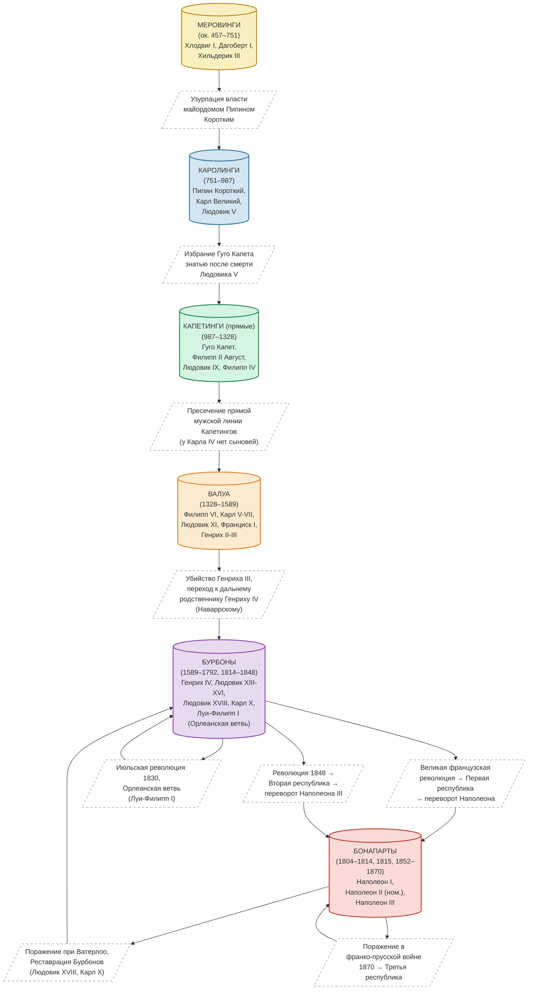

Французские короли.

<!--more-->



## 1 Хронологическая схема {#хронологическая-схема}

### 1.1 Меровинги (ок. 457–751) {#меровинги--ок-dot-457-751}

#### 1.1.1 Хлодвиг I (481–511) – крещение франков {#хлодвиг-i--481-511--крещение-франков}

#### 1.1.2 Хильдерик III (743–751) – свергнут {#хильдерик-iii--743-751--свергнут}

### 1.2 Каролинги (751–987) {#каролинги--751-987}

-   Майордом Пипин Короткий с согласия папы

#### 1.2.1 Пипин Короткий (751–768) {#пипин-короткий--751-768}

#### 1.2.2 Карл Великий (768–814) – император с 800 г. {#карл-великий--768-814--император-с-800-г-dot}

#### 1.2.3 Людовик Благочестивый (814–840) {#людовик-благочестивый--814-840}

#### 1.2.4 Верденский раздел (843) {#верденский-раздел--843}

#### 1.2.5 Людовик V Ленивый (986–987) – умер без наследника {#людовик-v-ленивый--986-987--умер-без-наследника}

### 1.3 Капетинги (987–1328) – прямые {#капетинги--987-1328--прямые}

-   Знать избирает Гуго Капета

#### 1.3.1 Гуго Капет (987–996) {#гуго-капет--987-996}

#### 1.3.2 Филипп II Август (1180–1223) {#филипп-ii-август--1180-1223}

#### 1.3.3 Людовик IX Святой (1226–1270) {#людовик-ix-святой--1226-1270}

#### 1.3.4 Филипп IV Красивый (1285–1314) {#филипп-iv-красивый--1285-1314}

#### 1.3.5 Карл IV Красивый (1322–1328) – без сыновей {#карл-iv-красивый--1322-1328--без-сыновей}

### 1.4 Валуа (1328–1589) – старшая боковая ветвь Капетингов {#валуа--1328-1589--старшая-боковая-ветвь-капетингов}

-   Пресечение прямых Капетингов, ближайший родственник по мужской линии

#### 1.4.1 Филипп VI (1328–1350) {#филипп-vi--1328-1350}

#### 1.4.2 Карл V, Карл VI, Карл VII (победитель в Столетней войне) {#карл-v-карл-vi-карл-vii--победитель-в-столетней-войне}

#### 1.4.3 Людовик XI, Карл VIII, Людовик XII, Франциск I {#людовик-xi-карл-viii-людовик-xii-франциск-i}

#### 1.4.4 Генрих II, Франциск II, Карл IX {#генрих-ii-франциск-ii-карл-ix}

#### 1.4.5 Генрих III (1574–1589) – убит, детей нет {#генрих-iii--1574-1589--убит-детей-нет}

### 1.5 Бурбоны (1589–1792, 1814–1848) – младшая боковая ветвь Капетингов {#бурбоны--1589-1792-1814-1848--младшая-боковая-ветвь-капетингов}

-   Ближайший родственник-гугенот Генрих Наваррский

#### 1.5.1 Генрих IV (1589–1610) – Нантский эдикт {#генрих-iv--1589-1610--нантский-эдикт}

#### 1.5.2 Людовик XIII, Людовик XIV (Король-Солнце) {#людовик-xiii-людовик-xiv--король-солнце}

#### 1.5.3 Людовик XV, Людовик XVI (казнён 1793) {#людовик-xv-людовик-xvi--казнён-1793}

#### 1.5.4 Французская революция → Первая республика (1792–1804) {#французская-революция-первая-республика--1792-1804}

#### 1.5.5 Реставрация: Людовик XVIII (1814–1824), Карл X (1824–1830) {#реставрация-людовик-xviii--1814-1824--карл-x--1824-1830}

#### 1.5.6 Июльская монархия (Орлеанская ветвь): Луи-Филипп I (1830–1848) {#июльская-монархия--орлеанская-ветвь--луи-филипп-i--1830-1848}

#### 1.5.7 Революция 1848 → Вторая республика {#революция-1848-вторая-республика}

### 1.6 Бонапарты – Первая империя (1804–1814, 1815) {#бонапарты-первая-империя--1804-1814-1815}

-   Переворот, затем провозглашение империи

#### 1.6.1 Наполеон I (1804–1814, 100 дней 1815) {#наполеон-i--1804-1814-100-дней-1815}

#### 1.6.2 Наполеон II (номинально 1815, не правил) {#наполеон-ii--номинально-1815-не-правил}

### 1.7 Вторая империя: Наполеон III (1852–1870) – племянник Наполеона I {#вторая-империя-наполеон-iii--1852-1870--племянник-наполеона-i}

### 1.8 Третья республика (1870–1940) – окончательный конец монархии во Франции {#третья-республика--1870-1940--окончательный-конец-монархии-во-франции}

-   Поражение в франко-прусской войне 1870

## 2 Смена династий {#смена-династий}

-   Меровинги → Каролинги: узурпация власти майордомом.
-   Каролинги → Капетинги: избрание Гуго Капета после смерти последнего Каролинга.
-   Капетинги → Валуа: отсутствие сыновей у Карла IV Красивого.
-   Валуа → Бурбоны: убийство Генриха III, престол перешёл к дальнему родственнику из Наварры.
-   Бурбоны → Бонапарты: Великая французская революция → Первая республика → переворот Наполеона.
-   Между Бурбонами и Бонапартами: чередование -- империя → реставрация Бурбонов → Июльская монархия (Бурбоны-Орлеаны) → Вторая республика → Вторая империя (Бонапарты).

<!--listend-->

