Английские короли.

<!--more-->



## 1 Хронологическая схема {#хронологическая-схема}

### 1.1 Уэссекская династия (ок. 886--1013, 1014--1016, 1042--1066) {#уэссекская-династия--ок-dot-886-1013-1014-1016-1042-1066}

-   Основана Альфредом Великим, который объединил англосаксонские королевства.

| Монарх                                        | Годы правления        |
|-----------------------------------------------|-----------------------|
| Альфред Великий (Alfred the Great)            | 871--899              |
| Эдуард Старший (Edward the Elder)             | 899--924              |
| Этельстан (Athelstan)                         | 925--939              |
| Эдмунд I (Edmund I)                           | 939--946              |
| Эдред (Eadred)                                | 946--955              |
| Эдвиг (Eadwig)                                | 955--959              |
| Эдгар Миролюбивый (Edgar the Peaceful)        | 959--975              |
| Эдуард Мученик (Edward the Martyr)            | 975--978              |
| Этельред II Неразумный (Æthelred the Unready) | 978--1013, 1014--1016 |
| Эдмунд II Железнобокий (Edmund Ironside)      | 1016                  |

### 1.2 Датская династия (1013--1014, 1016--1042) {#датская-династия--1013-1014-1016-1042}

-   Период правления датских королей, прервавший и временно сменивший Уэссекскую династию.

| Монарх                                  | Годы правления |
|-----------------------------------------|----------------|
| Свен I Вилобородый (Sweyn Forkbeard)    | 1013--1014     |
| Кнуд I Великий (Cnut the Great)         | 1016--1035     |
| Харальд I Заячья Лапа (Harold Harefoot) | 1035--1040     |
| Хардекнуд (Harthacnut)                  | 1040--1042     |

### 1.3 Уэссекская династия (восстановленная, 1042--1066) {#уэссекская-династия--восстановленная-1042-1066}

| Монарх                                   | Годы правления |
|------------------------------------------|----------------|
| Эдуард Исповедник (Edward the Confessor) | 1042--1066     |
| Гарольд II Годвинсон (Harold II)         | 1066           |

### 1.4 Нормандская династия (1066--1154) {#нормандская-династия--1066-1154}

-   Основана Вильгельмом Завоевателем после нормандского завоевания Англии.

| Монарх                              | Годы правления |
|-------------------------------------|----------------|
| Вильгельм I Завоеватель (William I) | 1066--1087     |
| Вильгельм II Рыжий (William II)     | 1087--1100     |
| Генрих I (Henry I)                  | 1100--1135     |
| Стефан (Stephen)                    | 1135--1154     |

### 1.5 Плантагенеты (Анжуйская династия) (1154--1399) {#плантагенеты--анжуйская-династия----1154-1399}

-   Одна из самых продолжительных и известных династий в истории Англии.

| Монарх                              | Годы правления |
|-------------------------------------|----------------|
| Генрих II (Henry II)                | 1154--1189     |
| Ричард I Львиное Сердце (Richard I) | 1189--1199     |
| Иоанн Безземельный (John)           | 1199--1216     |
| Генрих III (Henry III)              | 1216--1272     |
| Эдуард I (Edward I)                 | 1272--1307     |
| Эдуард II (Edward II)               | 1307--1327     |
| Эдуард III (Edward III)             | 1327--1377     |
| Ричард II (Richard II)              | 1377--1399     |

### 1.6 Ланкастеры (1399--1461, 1470--1471) {#ланкастеры--1399-1461-1470-1471}

-   Младшая ветвь Плантагенетов.
-   Их правление было отмечено Столетней войной и началом Войн Алой и Белой розы.

| Монарх               | Годы правления         |
|----------------------|------------------------|
| Генрих IV (Henry IV) | 1399--1413             |
| Генрих V (Henry V)   | 1413--1422             |
| Генрих VI (Henry VI) | 1422--1461, 1470--1471 |

### 1.7 Йорки (1461--1470, 1471--1485) {#йорки--1461-1470-1471-1485}

-   Другая ветвь Плантагенетов, соперничавшая с Ланкастерами за престол.

| Монарх                   | Годы правления         |
|--------------------------|------------------------|
| Эдуард IV (Edward IV)    | 1461--1470, 1471--1483 |
| Эдуард V (Edward V)      | 1483                   |
| Ричард III (Richard III) | 1483--1485             |

### 1.8 Тюдоры (1485--1603) {#тюдоры--1485-1603}

-   Династия, основанная Генрихом VII, который положил конец Войне Роз.

| Монарх                      | Годы правления |
|-----------------------------|----------------|
| Генрих VII (Henry VII)      | 1485--1509     |
| Генрих VIII (Henry VIII)    | 1509--1547     |
| Эдуард VI (Edward VI)       | 1547--1553     |
| Джейн Грей (Lady Jane Grey) | 1553 (9 дней)  |
| Мария I Кровавая (Mary I)   | 1553--1558     |
| Елизавета I (Elizabeth I)   | 1558--1603     |

### 1.9 Стюарты (1603--1649, 1660--1714) {#стюарты--1603-1649-1660-1714}

-   Начало правления этой династии ознаменовало объединение корон Англии и Шотландии (личная уния).

| Монарх             | Годы правления |
|--------------------|----------------|
| Яков I (James I)   | 1603--1625     |
| Карл I (Charles I) | 1625--1649     |

### 1.10 Английская республика (1649--1660) {#английская-республика--1649-1660}

-   Период, когда Англия была республикой во главе с Оливером Кромвелем.

### 1.11 Стюарты (1660--1714) {#стюарты--1660-1714}

| Монарх                                           | Годы правления          |
|--------------------------------------------------|-------------------------|
| Карл II (Charles II)                             | 1660--1685              |
| Яков II (James II)                               | 1685--1688              |
| Вильгельм III и Мария II (William III и Mary II) | 1689--1694 (совместно)  |
| Вильгельм III (William III)                      | 1694--1702 (единолично) |
| Анна (Anne)                                      | 1702--1714              |

-   В 1707 году, во время правления Анны, был принят Акт об унии, объединивший Англию и Шотландию в единое королевство Великобритания.

### 1.12 Ганноверская династия (1714--1901) {#ганноверская-династия--1714-1901}

| Монарх                    | Годы правления |
|---------------------------|----------------|
| Георг I (George I)        | 1714--1727     |
| Георг II (George II)      | 1727--1760     |
| Георг III (George III)    | 1760--1820     |
| Георг IV (George IV)      | 1820--1830     |
| Вильгельм IV (William IV) | 1830--1837     |
| Виктория (Victoria)       | 1837--1901     |

### 1.13 Саксен-Кобург-Готская династия (1901--1910) {#саксен-кобург-готская-династия--1901-1910}

| Монарх                  | Годы правления |
|-------------------------|----------------|
| Эдуард VII (Edward VII) | 1901--1910     |

### 1.14 Виндзоры (с 1910) {#виндзоры--с-1910}

-   В 1917 году, во время Первой мировой войны, из-за антигерманских настроений династия была переименована из Саксен-Кобург-Готской в Виндзоры.

| Монарх                      | Годы правления |
|-----------------------------|----------------|
| Георг V (George V)          | 1910--1936     |
| Эдуард VIII (Edward VIII)   | 1936 (отрекся) |
| Георг VI (George VI)        | 1936--1952     |
| Елизавета II (Elizabeth II) | 1952--2022     |
| Карл III (Charles III)      | с 2022         |

## 2 Смена династий {#смена-династий}

-   Уэссекская династия: Начало с Альфреда Великого, объединившего англосаксонские королевства. Прервалась датским завоеванием и восстановлена, но окончательно завершилась с нормандским завоеванием.
-   Нормандская династия: Основана Вильгельмом Завоевателем в 1066 году.
-   Плантагенеты: Самая продолжительная династия, правившая с 1154 по 1399 год. Включает Анжуйскую ветвь, а также Ланкастеров и Йорков как младшие ветви.
-   Ланкастеры и Йорки: Соперничали за престол в ходе Войн Алой и Белой розы (XV век), периодически сменяя друг друга.
-   Тюдоры: Генрих VII положил конец войне Роз и основал новую династию.
-   Стюарты: Пришли к власти после смерти Елизаветы I, объединив короны Англии и Шотландии. Их правление прерывалось периодом республики (1649--1660).
-   Ганноверская династия: Начало современного конституционного правления. Пришла на смену Стюартам согласно Акту о престолонаследии 1701 года.
-   Саксен-Кобург-Готская и Виндзоры: Короткая династия Эдуарда VII. В 1917 году, на фоне Первой мировой войны, переименована в Виндзоры.

```mermaid
flowchart TD
    %% Стили
    classDef wessex fill:#f9e79f,stroke:#d4ac0d,stroke-width:2px;
    classDef norman fill:#a9cce3,stroke:#2980b9,stroke-width:2px;
    classDef plantagenet fill:#a9dfbf,stroke:#1e8449,stroke-width:2px;
    classDef lancaster fill:#f5cba7,stroke:#e67e22,stroke-width:2px;
    classDef york fill:#f7dc6f,stroke:#d4ac0d,stroke-width:2px;
    classDef tudor fill:#f1948a,stroke:#c0392b,stroke-width:2px;
    classDef stuart fill:#d2b4de,stroke:#8e44ad,stroke-width:2px;
    classDef hanover fill:#85c1e9,stroke:#2471a3,stroke-width:2px;
    classDef saxe fill:#aeb6bf,stroke:#5d6d7e,stroke-width:2px;
    classDef windsor fill:#f8c471,stroke:#d4ac0d,stroke-width:2px;
    classDef transition fill:#ffffff,stroke:#7f8c8d,stroke-width:1px,stroke-dasharray:5;

    %% Узлы династий
    W1[("УЭССЕКСКАЯ ДИНАСТИЯ<br>(ок. 886–1013, 1014–1016, 1042–1066)<br>Альфред Великий, Этельстан,<br>Эдгар, Эдуард Исповедник")]
    N1[("НОРМАНДСКАЯ ДИНАСТИЯ<br>(1066–1154)<br>Вильгельм I Завоеватель,<br>Вильгельм II, Генрих I, Стефан")]
    P1[("ПЛАНТАГЕНЕТЫ (АНЖУЙСКАЯ ВЕТВЬ)<br>(1154–1399)<br>Генрих II, Ричард I, Иоанн,<br>Генрих III, Эдуард I, II, III,<br>Ричард II")]
    L1[("ЛАНКАСТЕРЫ<br>(1399–1461, 1470–1471)<br>Генрих IV, Генрих V, Генрих VI")]
    Y1[("ЙОРКИ<br>(1461–1470, 1471–1485)<br>Эдуард IV, Эдуард V, Ричард III")]
    T1[("ТЮДОРЫ<br>(1485–1603)<br>Генрих VII, Генрих VIII,<br>Эдуард VI, Мария I, Елизавета I")]
    S1[("СТЮАРТЫ<br>(1603–1649, 1660–1714)<br>Яков I, Карл I, Карл II,<br>Яков II, Мария II, Вильгельм III, Анна")]
    H1[("ГАННОВЕРСКАЯ ДИНАСТИЯ<br>(1714–1901)<br>Георг I, II, III, IV,<br>Вильгельм IV, Виктория")]
    SCG1[("САКСЕН-КОБУРГ-ГОТСКАЯ<br>(1901–1910)<br>Эдуард VII")]
    W2[("ВИНДЗОРЫ<br>(с 1910)<br>Георг V, Эдуард VIII, Георг VI,<br>Елизавета II, Карл III")]

    %% Переходы (причины смены династий)
    T_NORMAN[/"Нормандское завоевание<br>Вильгельмом Завоевателем"/]
    T_PLANT[/"Гражданская война<br>'Война Стефана и Матильды'"/]
    T_LAN[/"Свержение Ричарда II<br>Генрихом Болингброком"/]
    T_YORK[/"Войны Алой и Белой розы<br>Эдуард IV свергает Генриха VI"/]
    T_TUDOR[/"Войны Алой и Белой розы<br>Генрих Тюдор побеждает<br>Ричарда III при Босворте"/]
    T_STUART[/"Пресечение династии Тюдоров<br>Яков VI Шотландский<br>наследует престол как Яков I"/]
    T_COMMON[/"Английская республика<br>(1649–1660)"/]
    T_HANOVER[/"«Славная революция»<br>и Акт о престолонаследии 1701<br>Приглашение Георга I"/]
    T_WINDSOR[/"Переименование из-за<br>антинемецких настроений<br>в годы Первой мировой войны"/]

    %% Связи
    W1 --> T_NORMAN --> N1
    N1 --> T_PLANT --> P1
    P1 --> T_LAN --> L1
    L1 --> T_YORK --> Y1
    Y1 --> T_TUDOR --> T1
    T1 --> T_STUART --> S1
    S1 --> T_COMMON --> S1
    S1 --> T_HANOVER --> H1
    H1 --> SCG1
    SCG1 --> T_WINDSOR --> W2

    %% Применение классов
    class W1 wessex;
    class N1 norman;
    class P1 plantagenet;
    class L1 lancaster;
    class Y1 york;
    class T1 tudor;
    class S1 stuart;
    class H1 hanover;
    class SCG1 saxe;
    class W2 windsor;
    class T_NORMAN,T_PLANT,T_LAN,T_YORK,T_TUDOR,T_STUART,T_COMMON,T_HANOVER,T_WINDSOR transition;
```

<!--listend-->

## 3 Библиография {#библиография}

## Литература

