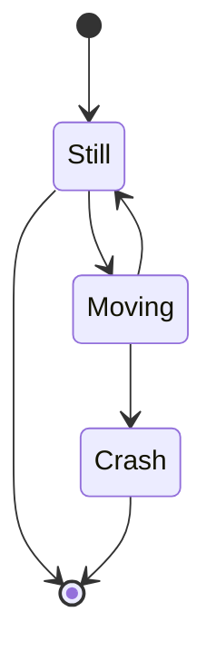

В данном случае описывается вариант Markdown для шаблона [Wowchemy](https://wowchemy.com/), набор операторов которой несколько шире, чем в стандартном [Hugo](https://gohugo.io/).

<!--more-->




## <span class="section-num">1</span> Основные элементы текста {#основные-элементы-текста}


### <span class="section-num">1.1</span> Заголовки {#заголовки}

```markdown
## Heading 2
### Heading 3
#### Heading 4
##### Heading 5
###### Heading 6
```

Максимальным уровнем заголовка поста является заголовок второго уровня (это не более, чем конвенция).


### <span class="section-num">1.2</span> Шрифтовые выделения {#шрифтовые-выделения}

```markdown
_Курсив_ - подчёркивания.
**Полужирный** - двойная звёздочка.
Можно объединить: **звёздочки и  _подчёркивания_**.
Для зачёркивания используем ~~двойную тильду~~.
```


### <span class="section-num">1.3</span> Списки {#списки}


#### <span class="section-num">1.3.1</span> Нумерованные {#нумерованные}

```markdown
1. First item
2. Another item
```


#### <span class="section-num">1.3.2</span> Ненумерованные {#ненумерованные}

```markdown
* First item
* Another item
```


#### <span class="section-num">1.3.3</span> Списки с отметками {#списки-с-отметками}

```markdown
- [x] Write math example
- [x] Write diagram example
- [ ] Do something else
```

Для интерактивности списка с отметками необходима поддержки со стороны хостера.


### <span class="section-num">1.4</span> Встраивание документов {#встраивание-документов}

В страницу могут быть встроены документы Google.
Чтобы встроить документы Google (например, презентацию):

-   нажмите `Файл -> Опубликовать в Интернете -> Встраивать в Документы Google`;
-   скопируйте URL-адрес в отображаемом атрибуте `src="..."`;
-   вставьте URL-адрес в форму:
    ```markdown
    
    ```


### <span class="section-num">1.5</span> Сноски {#сноски}

Используются сноски Markdown:

```markdown
Кроме того [^1], …

[^1]: Текст сноски.
```

Кроме того [^1], …

[^1]: Текст сноски.


## <span class="section-num">2</span> Изображения {#изображения}


### <span class="section-num">2.1</span> Одиночные изображения {#одиночные-изображения}

Статические изображения по-умолчанию подгружаются из каталога `assets/media/`.

-   Можно подключать изображение с помощью стандартного оператора `markdown`:
    ```markdown
    
    ```

-   Наряду со стандартной загрузкой изображений можно использовать и следующую конструкцию:
    ```markdown
    
    ```

-   Изображение можно помещать в папку страницы:
    ```markdown
    
    ```

-   Можно вставлять нумерованные рисунки:
    ```markdown
    
    ```
    С оператором `figure` используется библиотека `fancybox` для
    отображения картинок.


### <span class="section-num">2.2</span> Галерея изображений {#галерея-изображений}


#### <span class="section-num">2.2.1</span> В папке `assets/media/` {#в-папке-assets-media}

-   Добавить изображения в подпапку папки `assets/media/`.
-   Описать все изображения в заголовке поста:

<!--listend-->

```yaml
gallery_item:
  - album: gallery
    image: boards.jpg
    caption: A caption
  - album: gallery
    image: https://<url to image>
    caption: Another caption
```

-   Для отображения галереи на странице вставить оператор

<!--listend-->

```markdown

```


#### <span class="section-num">2.2.2</span> В папке страницы {#в-папке-страницы}

-   Создать папку с изображениями внутри папки страницы.
-   Для отображения галереи на странице вставить оператор

<!--listend-->

```markdown

```

-   Дополнительно можно описать изображения в заголовке поста:

<!--listend-->

```yaml
gallery_item:
  - album: <album_folder>
    image: <image_name>.jpg
    caption: Image caption
```

Следует заметить, что для страниц типа `doc` возможно размещение галереи только в папке `assets/media/`.


### <span class="section-num">2.3</span> Диаграммы {#диаграммы}

-   Для Markdown поддерживается расширение для рисования диаграмм [mermaid](https://mermaid-js.github.io/mermaid/) (см. [Диаграммы. Mermaid]()).
-   Для использования нужно включить эту функцию в файле `params.toml` или добавив `diagram: true` в преамбуле страницы.

Например, следующий код

````markdown

````

преобразуется в


### <span class="section-num">2.4</span> Графики {#графики}

Поддерживает библиотека [Plotly](https://plot.ly/). Для отрисовки графика следует сохранить файл Plotly в формате json в папке страницы.
Например, если файл называется `chart.json`, то он отрисовывается следующим оператором:

````markdown

````

Для создания файла json можно использовать онлайн редактор [Plotly JSON Editor](http://plotly-json-editor.getforge.io/).


## <span class="section-num">3</span> Мультимедийные данные {#мультимедийные-данные}


### <span class="section-num">3.1</span> Аудио {#аудио}

Подключение аудио поддерживается для локальных MP3-файлов:

````markdown

````

Путь к файлу задаётся от `static/media/`.


### <span class="section-num">3.2</span> Видео {#видео}


#### <span class="section-num">3.2.1</span> Локальные файлы {#локальные-файлы}

-   Подключение видео из `static/media/`:

<!--listend-->

````markdown

````

-   Подключение видео из папки страницы:

<!--listend-->

````markdown

````


#### <span class="section-num">3.2.2</span> Youtube {#youtube}

-   Видео, размещённое на _Youtube_:
    ````markdown
    
    ````


#### <span class="section-num">3.2.3</span> Vimeo {#vimeo}

-   Видео, размещённое на _Vimeo_:
    ````markdown
    
    ````


#### <span class="section-num">3.2.4</span> Rutube {#rutube}

-   Видео, размещённое на _Rutube_ (см. [Сокращение для видео Rutube для Hugo]()):
    ````markdown
    
    ````


#### <span class="section-num">3.2.5</span> Платформа {#платформа}

-   Видео, размещённое на _Платформа_ (см. [Сокращение для видео Платформа для Hugo]()):
    ````markdown
    
    ````


#### <span class="section-num">3.2.6</span> VK Video {#vk-video}

-   Видео, размещённое на _VK Video_ (см. [Hugo shortcode. Видео на VK Video]()).
-   Для вставки видео _VK Video_ используется следующая конструкция (с именованными параметрами):
    ````markdown
    
    ````
-   Для вставки видео _VK Video_ используется следующая конструкция (с позиционными параметрами):
    ````markdown
    
    ````


#### <span class="section-num">3.2.7</span> Размещение видео во вкладках {#размещение-видео-во-вкладках}

-   Одно и то же видео, размещённое на разных хостингах, удобно размещать во вкладках.
-   [Hugo. Видео во вкладках]()


## <span class="section-num">4</span> Разное {#разное}


### <span class="section-num">4.1</span> Таблицы {#таблицы}

-   Таблицы в формате _csv_ можно отображать с помощью оператора:
    ````markdown
    
    ````
-   Таблица в виде файла _csv_ должна находиться в папке страницы.


### <span class="section-num">4.2</span> Вкладки {#вкладки}

-   Тема _Wowchemy_ не поддерживает вкладки.
-   Можно добавить поддержку вкладок: [Hugo. Вкладки]().


## <span class="section-num">5</span> Ссылки {#ссылки}


### <span class="section-num">5.1</span> Стандартные ссылки {#стандартные-ссылки}

-   Можно использовать стандартный формат ссылок Markdown:
    ````markdown
    [I'm a link](https://www.google.com)
    ````


### <span class="section-num">5.2</span> Генерация ссылок {#генерация-ссылок}

-   Ссылки модно генерить с помощью операторов `ref` и `relref`:
    ````markdown
    
    
    
    
    
    
    
    
    
    
    
    ````

    -   `ref` задаёт абсолютную ссылку, `relref` --- относительную.

-   Эти ссылки можно использовать внутри стандартных ссылок Markdown:
    ````markdown
    [A post]()
    [A publication]()
    [A project]()
    [A relative link from one post to another post]()
    [Scroll down to a page section with heading *Hi*](#hi)
    ````


#### <span class="section-num">5.2.1</span> Ссылка на версию на другом языке {#ссылка-на-версию-на-другом-языке}

-   Чтобы создать ссылку на версию документа на другом языке, используйте следующий синтаксис:
    ````markdown
    
    ````


#### <span class="section-num">5.2.2</span> Ссылка на пакет страниц {#ссылка-на-пакет-страниц}

-   При ссылке на пакет страниц необходимо задать путь к пакету.
-   Возможно придётся задавать полный путь, поскольку краткий (только часть пути) может не сработать.


#### <span class="section-num">5.2.3</span> Другой формат вывода {#другой-формат-вывода}

-   Чтобы сослаться на другой формат вывода:
    ````markdown
    
    ````


#### <span class="section-num">5.2.4</span> Идентификаторы заголовков {#идентификаторы-заголовков}

-   Для документов markdown Hugo генерирует идентификаторы элементов для каждого заголовка на странице.
-   Например, для кода
    ````markdown
    ## Reference
    ````
    создаётся следующий HTML:
    ````html
    <h2 id="reference">Reference</h2>
    ````
-   Ссылку можно задать следующим образом:
    ````markdown
    
    
    ````
-   Идентификатор можно задать и явно:
    ````markdown
    ## Reference A {#foo}
    ## Reference B {id="bar"}
    ````


### <span class="section-num">5.3</span> Ссылка на статический файл {#ссылка-на-статический-файл}

-   Ссылка на файл из иерархии `static/`, обычно размещаемый в подкаталоге `static/files/`:
    ````markdown
    Download my CV
    ````

    -   Опция `newtab` используется для открытия файла в новой вкладке.


### <span class="section-num">5.4</span> Цитирование {#цитирование}

-   Цитирование страницы (ссылка на папку страницы):
    ````markdown
    
    ````
-   Опция `view` задаёт один из стандартных форматов:
    -   `Stream`,
    -   `Compact` (установлен по умолчанию),
    -   `Card`,
    -   Параметр устанавливается согласно `citation_style` из `params.toml`.


## <span class="section-num">6</span> Специальные элементы {#специальные-элементы}


### <span class="section-num">6.1</span> Содержание страницы (Table of Contents) {#содержание-страницы--table-of-contents}

-   Содержание страницы задаётся с помощью следующего оператора:

<!--listend-->

````markdown

````

-   Уровни заголовков, попадающие в содержание, задаются в `config.toml`

<!--listend-->

````toml
[markup.tableOfContents]
   endLevel = 3
   ordered = false
   startLevel = 2
````

-   Здесь содержание начинается со второго уровня (это соответствует соглашению об уровнях заголовков), а завершается третьим. При необходимости следует внести изменения.


### <span class="section-num">6.2</span> Отбивка резюме (Summary Splitter) {#отбивка-резюме--summary-splitter}

-   Отбивка резюме задаётся конструкцией

<!--listend-->

````html
<!--more-->
````
