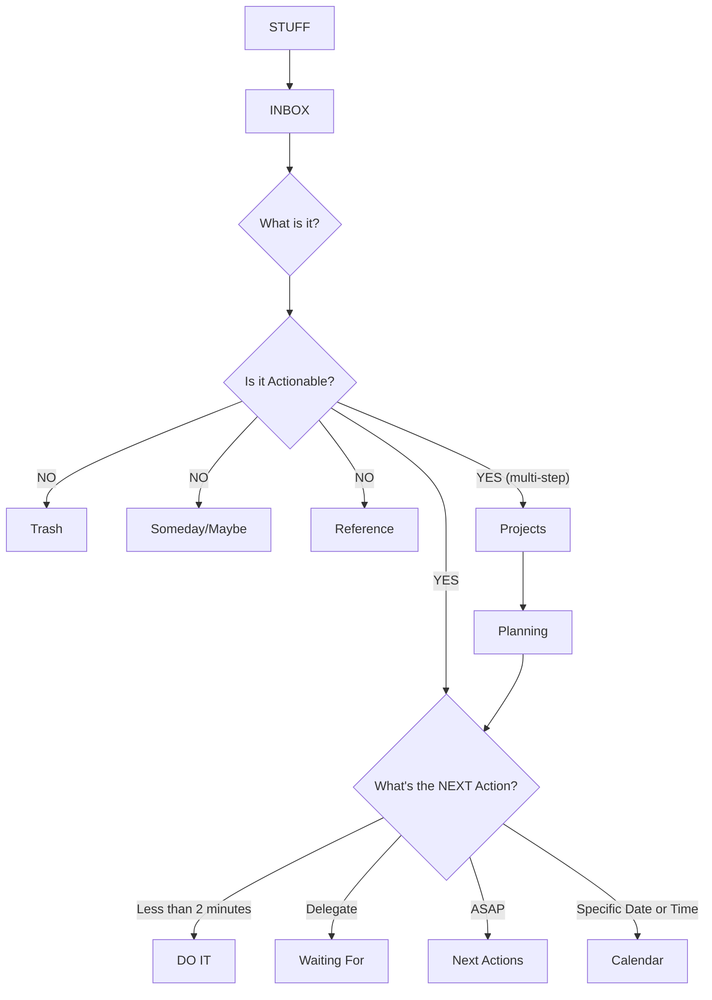

Реализация метода GTD на основе Emacs.

<!--more-->



## 1 Общая информация {#общая-информация}

-   Репозиторий: <https://github.com/Trevoke/org-gtd.el>
-   Пакет пытается максимально точно воспроизвести рабочий процесс GTD (см. [Метод GTD]()).

<!--listend-->

## 2 Режимы {#режимы}

-   `org-gtd-mode`: обновляет представления повестки дня, включать все файлы `org-gtd` в `org-agenda-files`.

## 3 Настраиваемые переменные {#настраиваемые-переменные}

-   `org-gtd-directory`: каталог, в котором `org-gtd` будет искать свои файлы.
-   `org-gtd-areas-of-focus`: список строк, представляющих Horizon 3.

## 4 Функции пакета по шагам GTD {#функции-пакета-по-шагам-gtd}

### 4.1 Шаг 1/6: Захват {#шаг-1-6-захват}

-   Функции:
    -   `org-gtd-capture`: обёртка вокруг `org-capture`. Можно использовать для сбора в Inbox.
-   Настраиваемые переменные:
    -   `org-gtd-capture-templates`: шаблоны для `org-gtd-capture`.

### 4.2 Шаг 2/6: Процесс {#шаг-2-6-процесс}

-   Функции:
    -   `org-gtd-process-inbox`: обработать все элементы в Inbox.

### 4.3 Шаг 3/6: Уточнение {#шаг-3-6-уточнение}

-   Функции:
    -   `org-gtd-clarify-item`: определить, для чего элемент из Inbox в рамках `org-gtd`.
    -   `org-gtd-clarify-agenda-item`: организовать пункта повестки дня в рамках `org-gtd`.
    -   `org-gtd-clarify-switch-to-buffer`: вернуться к любому существующему буферу уточнения, используйте вместо переключения обратно в обычный поток.
-   Клавиатура:
    -   `org-gtd-clarify-map`: клавиатурные комбинации в буфере уточнения.

### 4.4 Шаг 4/6: Организуйте {#шаг-4-6-организуйте}

-   Функции:
    -   `org-gtd-organize`: всплывающее меню с вопросом, как организовать (например, отдельное действие, встречу и т. д.) элемент в данный момент.
-   Хуки:
    -   `org-gtd-organize-hooks`: ряд функций, которые вызываются для оформления каждого элемента (например, тегов организации и т. д.).

### 4.5 Шаг 5/6: Ежедневное взаимодействие {#шаг-5-6-ежедневное-взаимодействие}

-   Функции:
    -   `org-gtd-engage`: ежедневный просмотр.
    -   `org-gtd-engage-grouped-by-context`: все действия NEXT, сгруппированные по тегам, начинающимся с @. Это может не сработать, если вы удалите `org-set-tags-command` из `org-gtd-organize-hooks`.

### 4.6 Шаг 6/6: Обзор {#шаг-6-6-обзор}

-   Функции:
    -   `org-gtd-oops`: Показать все пропущенные встречи.
    -   `org-gtd-review-area-of-focus`: показать представление повестки дня, предназначенное для одной из ваших областей деятельности.
    -   `org-gtd-review-stuck-*`: найти любой из типов деятельности, которые остались незамеченными.
