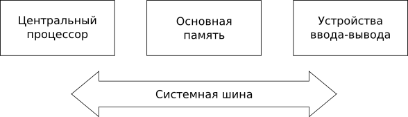
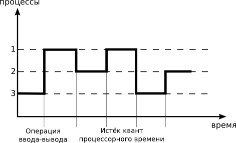
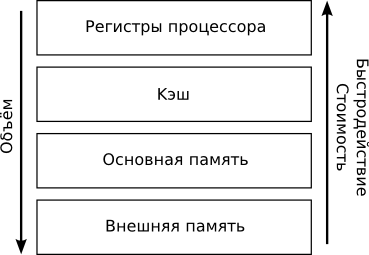
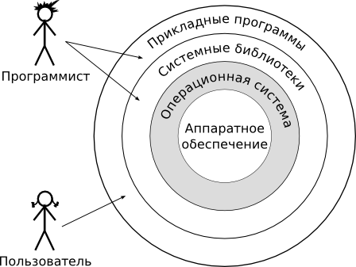

# Обзор компьютерных систем

---

## Структурные принципы

Современные компьютерные системы построены по трём принципам Джона фон
Неймана:

1.  программное управление

2.  однородность памяти

3.  адресность

---

## Основные структурные элементы компьютера

---

# Центральный процессор

---

## Центральный процессор

- извлекает программу из памяти
- декодирует
- исполняет машинные команды

---

## Псевдопараллелизм

- В каждый момент времени процессор может испонять только одну программу.

- Так как число процессоров конечно, необходимы алгоритмы, позволяющие
  чередовать исполнения процессов.

---

## Псевдопараллелизм

---

# Память

---

## Параметры конфигурации памяти

- объём
- быстродействие
- стоимость

---

## Иерархия видов памяти

- регистровая память хранит операнды команд 
- кэш используется для хранения самых используемых участков памяти
- основная память хранит исполняющиеся программы 
- внешняя память сохраняет данные и программы между запусками

---

## Иерархия видов памяти

---

# Управление вводом-выводом

---

## Взаимодействие с устройствами ввода-вывода

- программируемый ввод-вывод
- ввод-вывод с помощью прерываний
- прямой доступ к памяти (Direct Memory Access, DMA)

---

# Назначение операционной системы

---

## Операционная система

Комплекс взаимосвязанных программ, который действует как интерфейс
между приложениями и пользователями с одной стороны и аппаратурой
компьютера с другой стороны.

---

## Операционная система

---

# Операционная система как виртуальная машина

---

## Уровни вычислительной системы

- программное и аппаратное обеспечение можно выстроить в виде иерархии
- каждый уровень представляет собой виртуальную машину 
- интерфейсы виртуальной машины скрывают детали нижележащего уровня

---

## Уровни вычислительной системы

---

# Операционная система как менеджер ресурсов

---

## Ресурсы компьютера

-   процессорное время
-   основная память
-   внешние устройства
-   таймеры
-   некоторые процедуры операционной системы

---

## Управление ресурсами

Ресурсы распределяются между процессами

---

## Критерии эффективности

- **пропускная способность** --- число задач, выполненных за единицу времени
- **время реакции** --- время, прошедшее с момента ввода команды до получения отклика системы

---

# Архитектура операционной системы

---

## Функции операционной системы

- управление процессами
- управление памятью
- управление файлами и внешними устройствами
- защита данных и администрирование
- интерфейс прикладного программирования
- пользовательский интерфейс

---

## Структура операционной системы

- **ядро** --- модули, выполняющие основные функции операционной системы
- **компоненты**, реализующие дополнительные функции операционной системы (служебные программы, или утилиты)

---

# Монолитная операционная система

---

## Монолитное ядро

-   компонуется как одна программа
-   работает в привилегированном режиме
-   использующая быстрые переходы с одной процедуры на другую
-   не требующие переключения из привилегированного режима в
    пользовательский и наоборот

---

Переход из пользовательского режима в режим ядра осуществляется через
системные вызовы --- интерфейс ядра операционной системы

---

## Структура монолитного ядра операционной системы

---

# Микроядерная операционная система

---

## Микроядро

-   работает в привилегированном режиме
-   выполняет только минимум функций по управлению аппаратурой
-   высокоуровневые функции операционной системы выполняются
    специализированными компонентами --- серверами, работающими в
    пользовательском режиме
-   управление и обмен данными при этом осуществляется через передачу
    сообщений

---

## Микроядро

---

# История UNIX

---

---

# Классификация операционных систем по назначению

---

## Системы реального времени

-   сторого регламентированное время отклика на внешние события
-   одновременная обработка --- даже если одновременно происходит
    несколько событий, реакция системы на них не должна запаздывать

---

## Системы жёсткого реального времени

-   недопустимость никаких задержек ни при каких условиях
-   бесполезность результатов при опоздании
-   катастрофа при задержке реакции
-   цена опоздания бесконечно велика

---

## Система мягкого реального времени

-   за опоздание результатов приходится платить
-   снижение производительности системы, вызванное запаздыванием реакций, приемлемо

---

## Встраиваемые системы

- работают на специфическом аппаратном обеспечении
- обладают некоторыми требованиями к времени отклика системы
- минимизируют потребляемые ресурсы

---

## Операционные системы для супер-компьютеров

- особенно важны вопросы производительности и скорости обмена между элементами системы
- самыми распространёнными среди сверхпроизводительных систем являются  модификации операционной системы Linux

---

## Операционные системы для серверов

-   важна стабильность работы
-   важна безопасность
-   важна производительность
-   не важен интерфейс пользователя

---

## Операционные системы для домашних и офисных компьютеров

-   важен удобный пользовательский интерфейс
-   важна поддержка широкого круга устройств для персональных  компьютеров

---

## Исследовательские операционные системы

- GNU Hurd
- L4

---

# Резюме

---

## Резюме

- Операционные системы существуют в рамках информационно-вычислительных систем
- Компьютеры построены в соответствии с принципами фон Неймана: центральный процессор, основная память и устройства ввода-вывода
- Операционная система объединяет пользователей, программы и аппаратуру компьютера

---

- Две основные функции операционной системы: 
  - предоставление виртуальной машины 
  - управление ресурсами компьютера
- Операционная система состоит из модулей
- Ядро --- основа всей операционной системы

---

- Два типа ядер 
  - монолитные 
  - микроядра

---

- Выделяют операционные системы 
  - реального времени
  - для встраиваемых систем
  - для супер-компьютеров
  - для серверов
  - для домашних и офисных компьютеров
  - исследовательские

---

# Дополнительные материалы

---

## Дополнительные материалы

1.  Курячий Г. В. Операционная система UNIX. --- М.: Интуит.Ру, 2004. --- 292 с.: ил.
2.  МакКузик М. К., Невилл-Нил Дж. В. FreeBSD: архитектура и реализация. --- М.: КУДИЦ-ОБРАЗ, 2006. --- 800 с.
3.  Олифер В. Г., Олифер Н. А. Сетевые операционные системы. --- СПб.: Питер, 2005. --- 539 с.: ил.

---

4.  Рэймонд Э. С. Искусство программирования для UNIX. --- М.: Издательский дом «Вильямс», 2005. --- 544 стр.: ил.
5.  Вильям Столлингс Операционные системы, 4-е издание. --- М.: Издательский дом «Вильямс», 2002. --- 848 с.: ил.

---

# Вопросы для самоконтроля

---

## Вопросы для самоконтроля

1.  Каково назначение операционной системы? Почему говорят об
    операционной системе как виртуальной машине? Какими ресурсами и как
    управляет операционная система?

---

2.  Архитектура операционной системы: что такое ядро и прикладные
    программы? Чем отличаются монолитные и микроядерные системы?

---

3.  Какие можно выделить классы операционных систем? В чём заключаются
    их отличия?
